# 設定及管理您的Content AI來源

本指南會逐步帶您瞭解如何在Cloud Manager中設定Content AI來源，從滿足必要條件到建立內容來源並確認其已編制索引和可供使用。

## 先決條件 {#prerequisites}

開始之前，請確定已符合下列條件：

* 您有一個使用中的Cloud Manager計畫，其中包含至少一個AEM as a Cloud Service環境。
* 您在Admin Console中擁有該程式的&#x200B;**[系統管理員](https://experienceleague.adobe.com/en/docs/support-resources/adobe-support-tools-guide/adobe-admin-console/admin-roles)**&#x200B;角色。
* 已在&#x200B;**Adobe Admin Console**&#x200B;中布建環境產品設定檔，請參閱[設定Adobe Developer Console專案](setup-adc-project.md)。

## 步驟1 — 開啟Content AI Configuration標籤 {#open-tab}

1. 登入[Cloud Manager](https://my.cloudmanager.adobe.com/)並選取您的程式。

   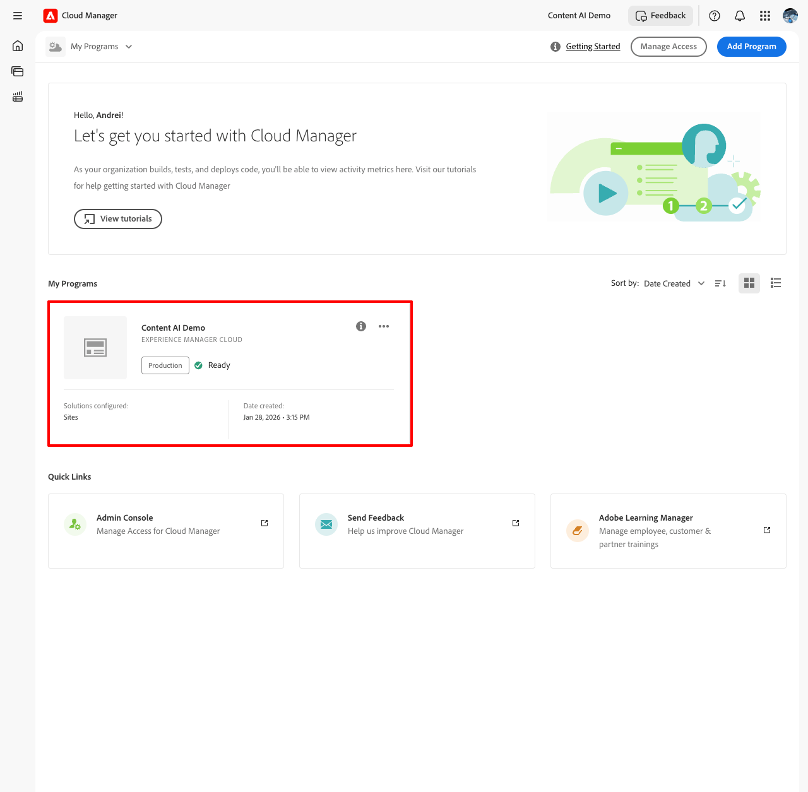

1. 從&#x200B;**[!UICONTROL 計畫總覽]**，找到&#x200B;**[!UICONTROL 環境]**&#x200B;區段，然後選取您要設定的環境。

   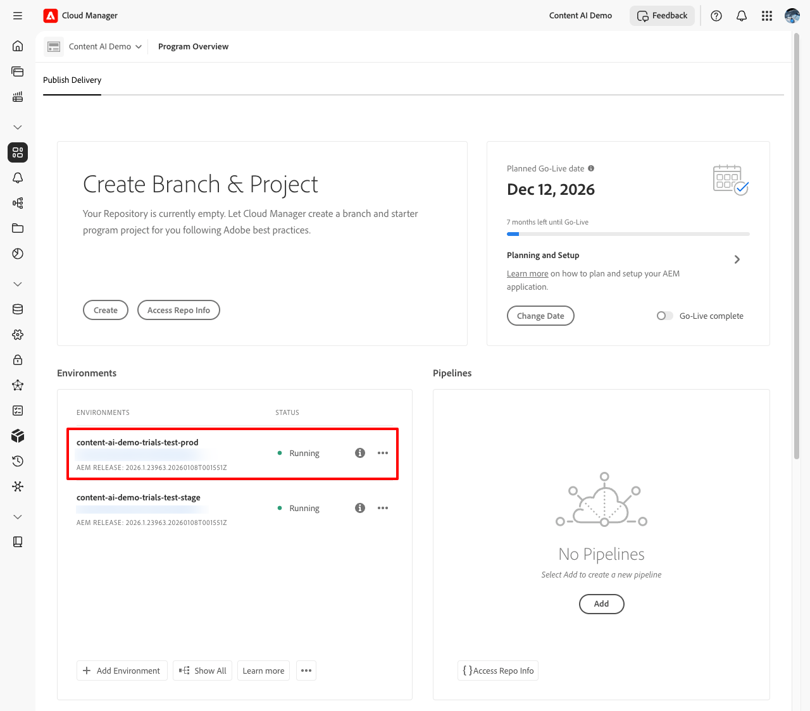

1. 在環境詳細資訊頁面上，選取&#x200B;**[!UICONTROL Content AI設定]**&#x200B;索引標籤。

   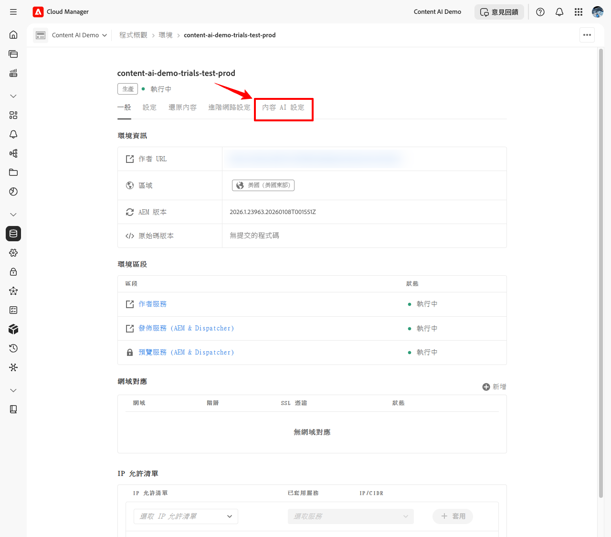

## 步驟2 — 建立Content AI Source {#create-source}

內容來源會定義Content AI抓取和編制索引的網站。

1. 在&#x200B;**[!UICONTROL Content AI設定]**&#x200B;索引標籤上，選取&#x200B;**[!UICONTROL 建立Source]**。

   ![顯示[建立Source]按鈕的[Content AI設定]索引標籤](../assets/content-ai-onboarding-step-4.png)

1. 在&#x200B;**[!UICONTROL 建立/新增Content AI Source]**&#x200B;對話方塊中，填寫欄位：

   | 欄位 | 說明 |
   | --- | --- |
   | **[!UICONTROL Content AI設定名稱]** | 此來源的唯一識別碼（例如，`my-site-index`）。 建立後即無法變更。 |
   | **[!UICONTROL 說明]** | *（選擇性）*&#x200B;內容來源的簡短說明。 |
   | **[!UICONTROL 網站位址]** | 要抓取之網站的根URL （例如，`https://www.example.com/`）。 |
   | **[!UICONTROL 排除URL]** | *（選擇性）*&#x200B;抓取期間要略過的URL模式。 |
   | **[!UICONTROL 重新整理頻率]** | Content AI重新抓取來源的頻率：每週、每日、每日4×、60分鐘或15分鐘。 |

   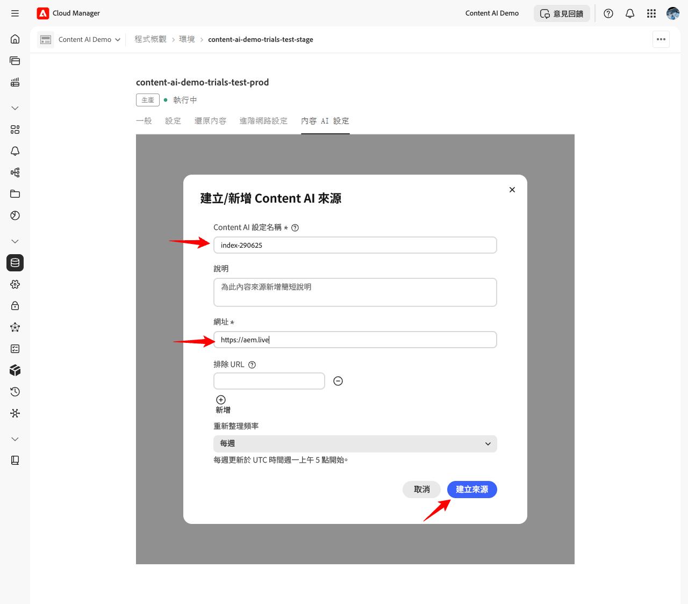

   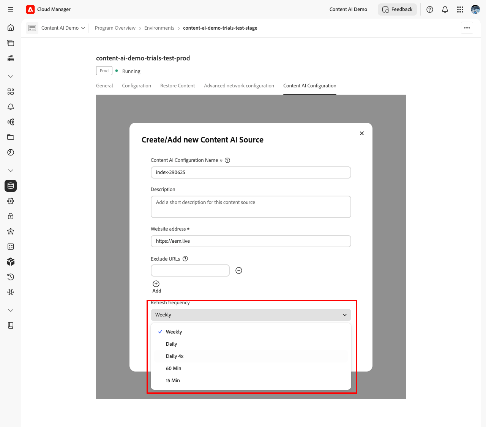

1. 選取&#x200B;**[!UICONTROL 建立Source]**。

## 步驟3 — 觸發贏取 {#trigger-acquisition}

建立來源之後，其狀態為&#x200B;**New**。 執行初始贏取以開始建立索引。

1. 在來源清單中，選取來源旁的&#x200B;**更多動作** (...)圖示，然後選取&#x200B;**[!UICONTROL 觸發贏取]**。

   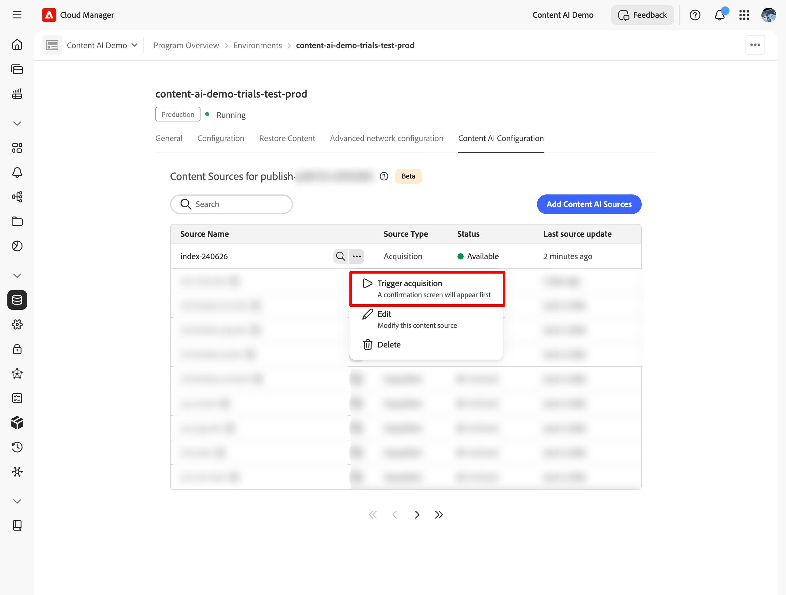

1. 在&#x200B;**[!UICONTROL 觸發程式贏取]**&#x200B;對話方塊中，檢閱來源詳細資料 — **[!UICONTROL 內容來源]**、**[!UICONTROL 上次執行]**&#x200B;及&#x200B;**[!UICONTROL 下次排程執行]** — 並選取&#x200B;**[!UICONTROL 觸發程式]**。

   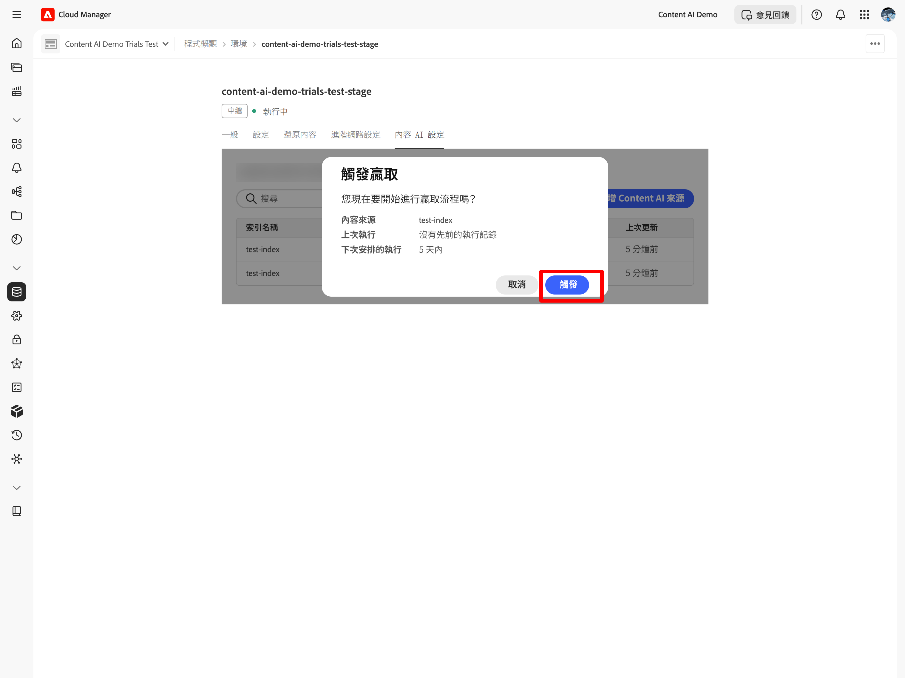

## 步驟4 — 監視索引狀態 {#monitor-status}

贏取開始後，來源狀態會即時更新。

| 狀態 | 含義 |
| --- | --- |
| **新增** | Source已建立；尚未執行任何贏取。 |
| **索引** | 正在擷取；正在抓取內容並編制索引。 |
| **可用** | 索引已完成；來源已準備好提供搜尋查詢。 |

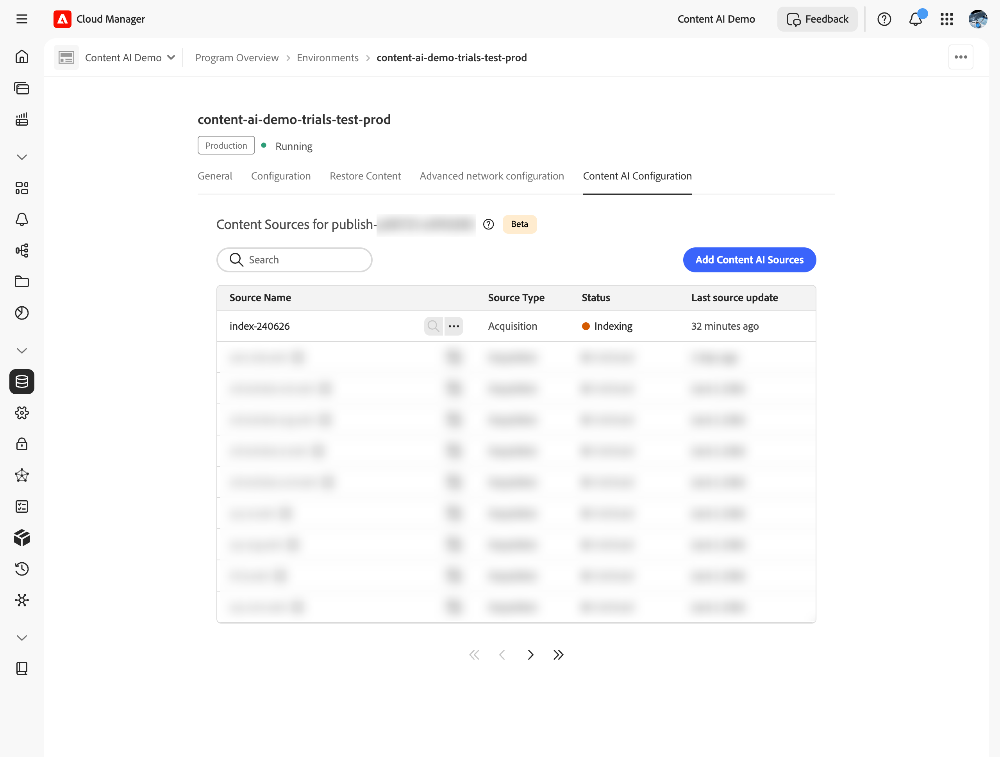

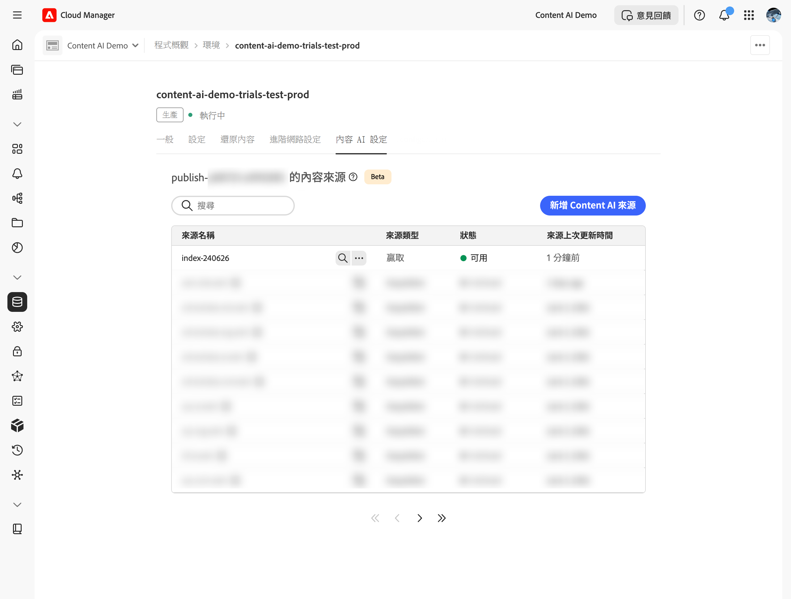

在搜尋索引或測試API之前，請等候狀態達到&#x200B;**可用**。

## 步驟5 — 搜尋索引內容 {#search-content}

一旦來源狀態為&#x200B;**可用**，您就可以直接從Cloud Manager執行搜尋查詢，以確認內容已正確編制索引。

1. 在來源清單中，選取來源旁的&#x200B;**[!UICONTROL 搜尋]**。

   ![在可用來源上反白顯示[搜尋]按鈕的內容來源清單](../assets/content-ai-onboarding-step-13.png)

1. 在搜尋欄位中輸入查詢。 結果會顯示具有相符評分和內容型別的相符專案清單（例如，**PAGE**&#x200B;或&#x200B;**PDF**）。 選取結果會在右側開啟預覽。

   

## 修改或刪除Source {#modify-source}

要在建立來源組態之後更新它：

1. 在來源清單中，選取來源旁的&#x200B;**更多動作** (...)圖示，然後選取&#x200B;**[!UICONTROL 編輯]**。

   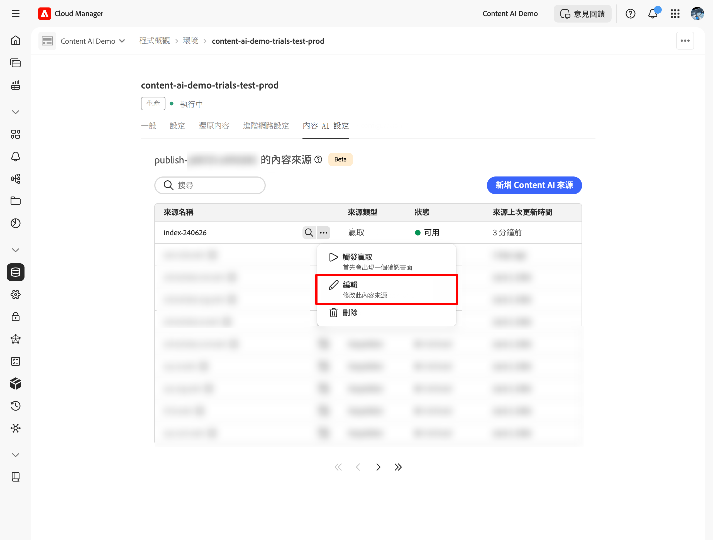

1. 在&#x200B;**[!UICONTROL 修改內容人工智慧Source]**&#x200B;對話方塊中，視需要更新&#x200B;**[!UICONTROL 描述]**、**[!UICONTROL 網站位址]**、**[!UICONTROL 排除URL]**&#x200B;或&#x200B;**[!UICONTROL 重新整理頻率]**。 **[!UICONTROL Content AI設定名稱]**&#x200B;是唯讀的，無法變更。

1. 選取[儲存]以套用變更，或選取對話方塊左下角的[刪除]以完全移除來源。********

   >[!WARNING]
   >
   >刪除來源是永久性的。 該來源的所有索引內容都會移除，且無法再提供搜尋查詢。

   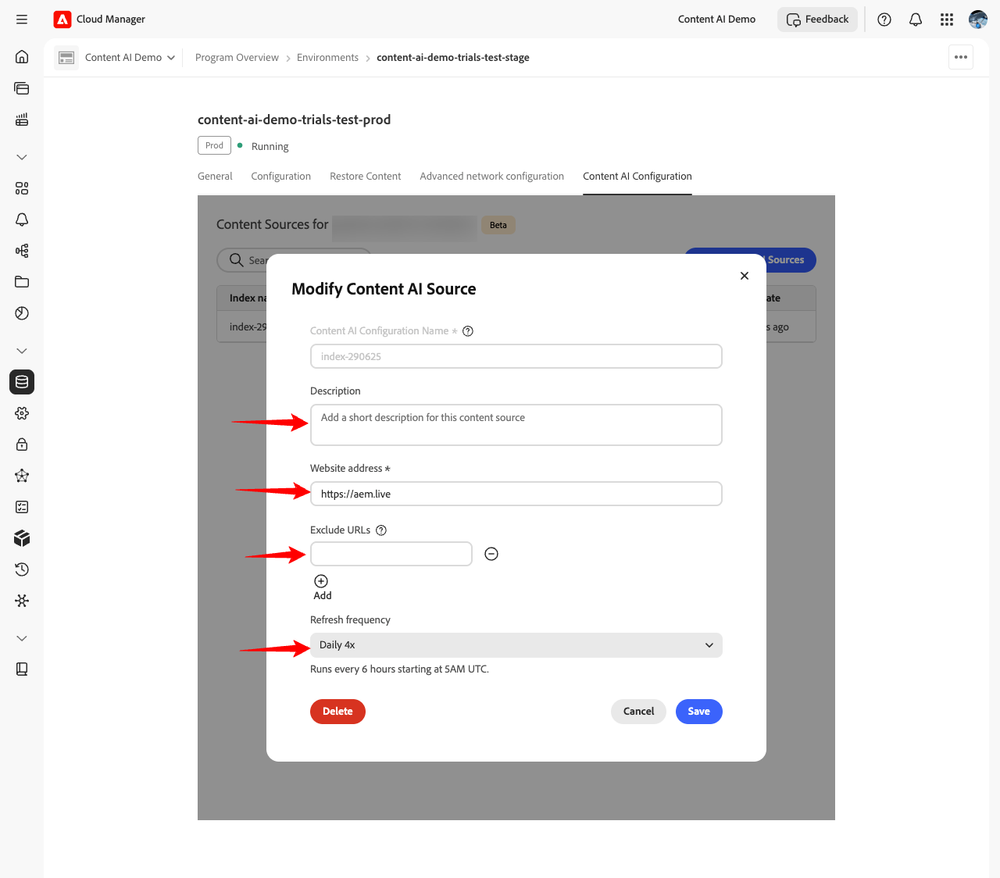

來源清單會更新以反映您的變更。 如果您刪除了來源，它就不會再出現在清單中。

## 後續步驟 {#next-steps}

* [設定Adobe Developer Console專案](setup-adc-project.md) — 建立呼叫API所需的ADC專案和認證。
* [Content AI API參考](https://developer.adobe.com/experience-cloud/experience-manager-apis/api/experimental/contentai/) — 使用語意、全文檢索或混合式搜尋端點查詢您的索引內容。

## 疑難排解 {#troubleshooting}

* **Source會在[!UICONTROL 索引]中保留很長的時間。** 從(...)功能表重試贏取。 如果狀態在第二次執行後未前進，請確認&#x200B;**[!UICONTROL 網站位址]**&#x200B;可公開存取，且&#x200B;**[!UICONTROL 排除URL]**&#x200B;模式不會篩選出每個頁面。
* **Source在執行後移回[!UICONTROL 新的]。** 爬蟲無法從設定的根URL擷取任何頁面。 確認URL以`200 OK`回應，且網站未封鎖自動要求。
* **[!UICONTROL 搜尋]未傳回[!UICONTROL 可用]來源的結果。** 索引成功，但沒有符合查詢的內容。 請嘗試更廣泛的查詢，或檢查抓取的URL是否包含您期望的頁面。
