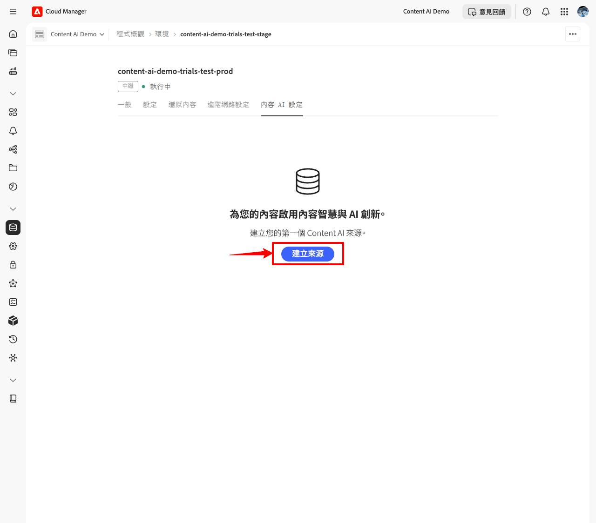
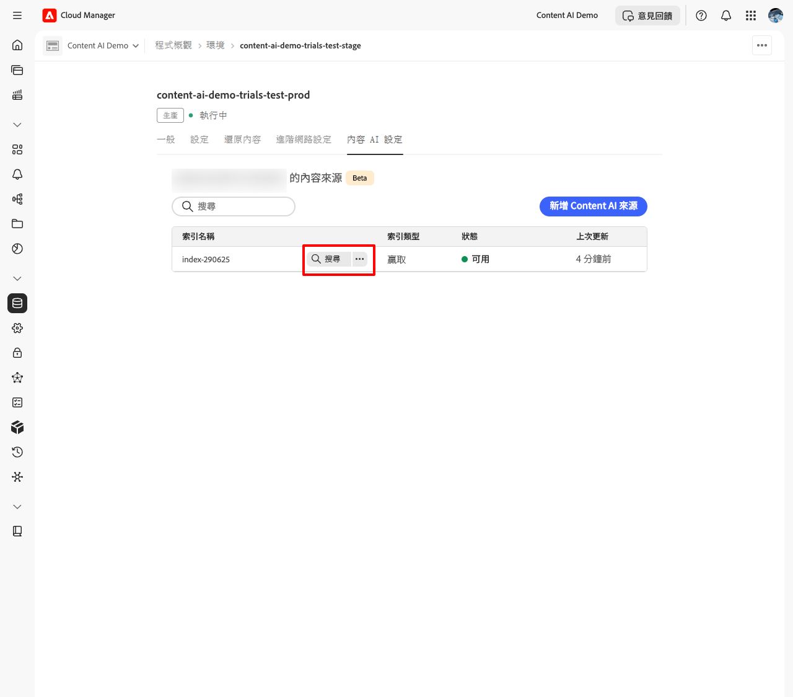

# 設定及管理您的 Content AI 來源

本指南會逐步帶您了解如何在 Cloud Manager 中設定 Content AI 來源，從滿足必要條件到建立內容來源並確認其已編製索引和可供使用。

## 先決條件 {#prerequisites}

開始之前，請確定已符合下列條件：

* 您有一個使用中的 Cloud Manager 程式，其中包含至少一個 AEM as a Cloud Service 環境。
* 您在 Admin Console 中擁有該程式的&#x200B;**[系統管理員](https://experienceleague.adobe.com/zh-hant/docs/support-resources/adobe-support-tools-guide/adobe-admin-console/admin-roles)**&#x200B;角色。
* 已在 **Adobe Admin Console** 中布建環境產品設定檔，請參閱[設定 Adobe Developer Console 專案](setup-adc-project.md)。

## 步驟 1 - 開啟「Content AI 設定」索引標籤 {#open-tab}

1. 登入 [Cloud Manager](https://my.cloudmanager.adobe.com/)  並選取您的程式。

   

1. 從&#x200B;**[!UICONTROL 程式概觀]**，找到&#x200B;**[!UICONTROL 環境]**&#x200B;區段，然後選取您要設定的環境。

   

1. 在環境詳細資訊頁面上，選取「**[!UICONTROL Content AI 設定]**」索引標籤。

   

## 步驟 2 - 建立 Content AI 來源 {#create-source}

內容來源會定義 Content AI 抓取和編製索引的網站。

1. 在「**[!UICONTROL Content AI 設定]**」索引標籤上，選取「**[!UICONTROL 建立來源]**」。

   

1. 在「**[!UICONTROL 建立/新增 Content AI 來源]**」對話框中，填寫欄位：

   | 欄位 | 說明 |
   | --- | --- |
   | **[!UICONTROL Content AI 設定]** | 此來源的唯一識別碼 (例如 `my-site-index`)。 建立後即無法變更。 |
   | **[!UICONTROL 說明]** | *(選擇性)* 內容來源的簡短說明。 |
   | **[!UICONTROL 網站位址]** | 要抓取之網站的根 URL (例如 `https://www.example.com/`)。 |
   | **[!UICONTROL 排除 URL]** | *(選擇性)* 抓取期間要略過的 URL 模式。 |
   | **[!UICONTROL 重新整理頻率]** | Content AI 重新抓取來源的頻率：每週、每日、每日 4×、60 分鐘或 15 分鐘。 |

   

   

1. 選取「**[!UICONTROL 建立來源]**」。

## 步驟 3 - 觸發贏取 {#trigger-acquisition}

建立來源之後，其狀態為&#x200B;**新增**。 執行初始贏取以開始建立索引。

1. 在來源清單中，選取來源旁的「**更多動作**  (...)」圖示，然後選取「**[!UICONTROL 觸發贏取]**」。

   

1. 在「**[!UICONTROL 觸發贏取]**」對話框中，審閱來源詳細資料：**[!UICONTROL 內容來源]**、**[!UICONTROL 上次執行]**&#x200B;及&#x200B;**[!UICONTROL 下次排程執行]**，並選取「**[!UICONTROL 觸發]**」。

   

## 步驟 4 - 監視索引狀態 {#monitor-status}

贏取開始後，來源狀態會即時更新。

| 狀態 | 含義 |
| --- | --- |
| **新增** | 來源已建立；尚未執行任何贏取。 |
| **建立索引** | 正在贏取；正在抓取內容並編製索引。 |
| **可用** | 索引已完成；來源已準備好提供搜尋查詢。 |

在搜尋索引或測試 API 之前，請等候狀態達到&#x200B;**可用**。

## 步驟 5 - 搜尋索引內容 {#search-content}

一旦來源狀態為&#x200B;**可用**，您就可以直接從 Cloud Manager 執行搜尋查詢，以確認內容已正確編製索引。

1. 在來源清單中，選取來源旁的「**[!UICONTROL 搜尋]**」。

   

1. 在搜尋欄位中輸入查詢。 結果會顯示具有相符評分和內容類型的相符項目清單 (例如 **PAGE** 或 **PDF**)。 選取結果會在右側開啟預覽。

   

## 修改或刪除來源 {#modify-source}

在建立來源之後將其設定更新：

1. 在來源清單中，選取來源旁的「**更多動作** (...)」圖示，然後選取「**[!UICONTROL 編輯]**」。

   

1. 在「**[!UICONTROL 修改 Content AI 來源]**」對話框中，視需要更新&#x200B;**[!UICONTROL 說明]**、**[!UICONTROL 網站位址]**、**[!UICONTROL 排除 URL]** 或&#x200B;**[!UICONTROL 重新整理頻率]**。 **[!UICONTROL Content AI 設定名稱]**&#x200B;是唯讀的，無法變更。

1. 選取「**[!UICONTROL 儲存]**」以套用變更，或選取對話框左下角的「**[!UICONTROL 刪除]**」以完全移除來源。

   >[!WARNING]
   >
   >刪除來源是永久操作。 該來源的所有索引內容都會移除，且無法再提供搜尋查詢。

   

來源清單會更新，反映出您的變更。 如果您刪除了來源，就不會再出現在清單中。

## 後續步驟 {#next-steps}

* [設定 Adobe Developer Console 專案](setup-adc-project.md)  - 建立呼叫 API 所需的 ADC 專案和認證。
* [Content AI API 參考](https://developer.adobe.com/experience-cloud/experience-manager-apis/api/experimental/contentai/) - 使用語意、全文或混合式搜尋端點查詢您的索引內容。

## 疑難排解 {#troubleshooting}

* **來源會在[!UICONTROL 索引]中長時間保留。** 從 (...) 選單重試贏取。 如果狀態在第二次執行後未前進，請確認&#x200B;**[!UICONTROL 網站位址]**&#x200B;可公開存取，且&#x200B;**[!UICONTROL 排除 URL]** 模式不會篩選出每個頁面。
* **來源在執行後移回[!UICONTROL 新增]。** 爬蟲無法從設定的根 URL 擷取任何頁面。 確認 URL 以 `200 OK` 回應，且網站未封鎖自動要求。
* **[!UICONTROL 搜尋]未傳回[!UICONTROL 可用]來源的結果。** 索引成功，但沒有符合查詢的內容。 請嘗試更廣泛的查詢，或檢查抓取的 URL 是否包含您期望的頁面。
