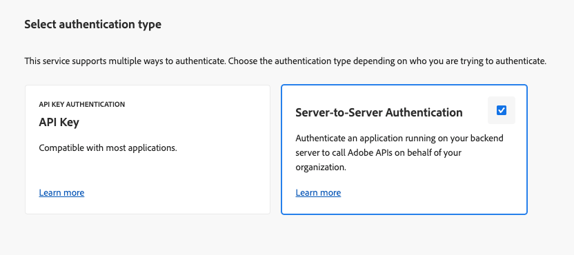

# 設定 Adobe Developer Console 專案 {#configure-adc-project}

若要呼叫 AEM Content AI 服務 API，您需要由 Adobe Developer Console (ADC) 專案核發的認證。 此頁面會逐步引導您建立專案、選取驗證方法，以及產生您隨每個 API 請求包含的認證。

前往 [Adobe Developer Console](https://developer.adobe.com/console/) 讓您的組織開始。

## 先決條件 {#prerequisites}

在開始之前，請確保已滿足以下條件：

* 您擁有您的組織之 [Adobe Developer Console](https://developer.adobe.com/console/) 存取權。
* 您在 **Adobe Admin Console** 的 AEM Content AI 服務產品設定檔中被新增為&#x200B;**開發人員**。 若沒有此角色，**[!UICONTROL AEM Content AI 服務]**  API 卡片會顯示為停用，且&#x200B;**[!UICONTROL 伺服器對伺服器]**&#x200B;驗證選項會隱藏。
* 您知道要選取之產品設定檔的程式和環境編號 (例如 `AEM User - publish - Program 12345 - Environment 67890`)。

## 選擇驗證方法 {#choose-auth}

AEM Content AI 服務支援兩種驗證方法。 挑選符合您整合要求的方法：

| 方法 | 最適合 |
| --- | --- |
| [伺服器對伺服器](#s2s-auth) | 無需使用者互動即可呼叫 API 的後端服務。 傳回短期存取權杖。 |
| [API 金鑰](#api-key-auth) | 直接呼叫 API 的用戶端或瀏覽器式整合。 傳回範圍設定為允許網域的長期金鑰。 |

## 伺服器對伺服器驗證 {#s2s-auth}

1. 選取 **[!UICONTROL API 和服務]**，然後選取 **[!UICONTROL API]**。

   

1. 依&#x200B;**AEM Content AI 服務**&#x200B;篩選，然後選取&#x200B;**[!UICONTROL 建立專案]**&#x200B;以開始新專案，或如果您要將服務新增至現有專案，則選取&#x200B;**[!UICONTROL 新增 API]**。

   >[!NOTE]
   >
   >如果 API 卡片停用並出現「需要授權」訊息，您的 AEM as a Cloud Service 環境可能無法現代化。 請參閱 [AEM as a Cloud Service 環境的現代化](https://experienceleague.adobe.com/zh-hant/docs/experience-manager-learn/cloud-service/aem-apis/openapis/setup#modernization-of-aem-as-a-cloud-service-environment)。

1. 在「**[!UICONTROL 設定 API]**」對話框中，選取&#x200B;**[!UICONTROL 伺服器對伺服器]**&#x200B;驗證。

   

   >[!TIP]
   >
   >如果伺服器對伺服器選項無法使用，則設定整合的使用者不會以開發人員身分新增至產品設定檔。 請參閱[啟用伺服器對伺服器驗證](https://developer.adobe.com/developer-console/docs/guides/authentication/ServerToServerAuthentication/implementation)。

1. 如有需要，請重新命名認證。 選取&#x200B;**[!UICONTROL 「下一步」]**。

   

1. 選取「**[!UICONTROL AEM 使用者 - 發佈 - 程式 XXX - 環境 XXX]**」和/或「**[!UICONTROL AEM使用者 - 作者 - 程式 XXX - 環境 XXX]**」產品設定檔，然後選取「**[!UICONTROL 儲存]**」。

   

1. 審閱 API 和驗證設定。

   

   

### 產生存取權杖 {#generate-token}

1. 在您的 ADC 專案中，前往「**[!UICONTROL 認證]**」並選取「**[!UICONTROL 產生存取權杖]**」。

   

1. 在每個 API 請求的 `Authorization` 標頭中包含權杖：

   ```http
   Authorization: Bearer YOUR_ACCESS_TOKEN
   ```

   >[!WARNING]
   >
   >安全地儲存權杖。 權杖過期，必須定期重新產生。

## API 金鑰驗證 {#api-key-auth}

1. 將 AEM Content AI 服務 API 新增至專案時，請在「**[!UICONTROL 選取驗證類別]**」對話框中選取「**[!UICONTROL API 金鑰]**」。

   

1. 確認 API 金鑰認證。

   

1. 若要限制可以使用金鑰的來源，請設定允許的網域。

   

1. 您的 API 金鑰 (用戶端 ID) 會顯示在&#x200B;**[!UICONTROL 已連線的認證]**&#x200B;下。 選取「**[!UICONTROL 複製]**」。

   

1. 在每個 API 要求中納入金鑰：

   ```http
   x-api-key: YOUR_API_KEY
   ```

   您的專案現已準備就緒。 將金鑰用於對 AEM Content AI 服務的每個請求。

## 後續步驟 {#next-steps}

* [控制您的內容來源](contentsources.md)：在 Cloud Manager 中設定內容來源並觸發贏取。
* [Content AI API 參考](https://developer.adobe.com/experience-cloud/experience-manager-apis/api/experimental/contentai/)  - 使用您的存取權杖或 API 金鑰來查詢已編製索引的內容。
